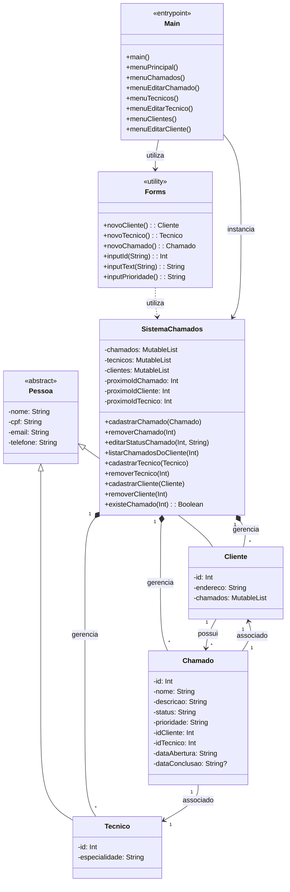

# 🚀 Sistema de Controle de Chamados Técnicos

✨ Este é um projeto acadêmico desenvolvido para a disciplina de Programação Orientada a Objetos (POO). O sistema permite o gerenciamento de chamados técnicos, incluindo cadastro de clientes, técnicos e chamados, controle de status e prioridades, e geração de relatórios de atendimento.

---

## 📚 Índice

1. [📝 Descrição do Projeto](#-descrição-do-projeto)
2. [🎯 Requisitos Funcionais](#-requisitos-funcionais)
3. [⚙️ Requisitos Técnicos](#️-requisitos-técnicos)
4. [✨ Funcionalidades Adicionais](#-funcionalidades-adicionais)
5. [💻 Como Executar o Projeto](#-como-executar-o-projeto)
6. [📊 Diagrama de Classes](#-diagrama-de-classes)
7. [💡 Decisões de Projeto](#-decisões-de-projeto)
8. [🚧 Desafios Enfrentados](#-desafios-enfrentados)

---

## 📝 Descrição do Projeto

📚 O **Sistema de Controle de Chamados Técnicos** foi desenvolvido para gerenciar chamados técnicos em uma empresa ou organização. Ele permite:

- Cadastro, edição, exclusão e consulta de clientes, técnicos e chamados.
- Controle de status (`Aberto`, `Em atendimento`, `Concluído`) e prioridade (`Alta`, `Média`, `Baixa`).
- Geração de relatórios de atendimento.
- Persistência de dados em arquivos `.csv`.

🧱 O sistema é implementado em **Kotlin**, utilizando princípios de POO, como encapsulamento, herança, polimorfismo e interfaces.

---

## 🎯 Requisitos Funcionais

1. **Cadastro, Edição, Exclusão e Consulta** 📝:
   - O sistema permite o cadastro, edição, exclusão e consulta de clientes, técnicos e chamados.
   - Cada entidade possui atributos específicos e métodos para manipulação.

2. **Funcionalidades Específicas** 🔧:
   - Abertura e fechamento de chamados técnicos. 
   - Atribuição de técnicos aos chamados.
   - Controle de status e prioridade dos chamados.

3. **Relatórios** 📊:
   - Geração de relatórios de atendimento, listando todos os chamados com seus respectivos clientes e status.

---

## ⚙️ Requisitos Técnicos

1. **Classes e Objetos** 🏗️:
   - As classes principais são: `Pessoa`, `Cliente`, `Tecnico`, `Chamado` e `SistemaChamados`.
   - Todas as classes seguem o princípio de encapsulamento, com atributos privados e métodos públicos (getters e setters).

2. **Herança e Polimorfismo** 🌳:
   - A classe `Pessoa` é a base para `Cliente` e `Tecnico`.
   - Interfaces como `RelatorioGeravel` e `Persistivel` garantem comportamentos comuns.

3. **Coleções** 📂:
   - Utilizamos `MutableList` para armazenar clientes, técnicos e chamados.

4. **Exceções** ❗:
   - Implementamos tratamento de exceções para situações como cliente não encontrado ou chamado inválido.

5. **Persistência de Dados** 💾:
   - Os dados são salvos e carregados em arquivos `.csv` para persistência.

---

## 💡 Funcionalidades Adicionais

1. **Validação de Dados** ✅:
   - Entradas do usuário (CPF, e-mail, etc.) podem ser validadas antes de serem processadas.

2. **Interface de Usuário** 🖥️:
   - O sistema possui uma interface simples via console, com um menu interativo que permite ao usuário realizar operações até escolher sair.

---

## 💻 Como Executar o Projeto

### 🛠️ Pré-requisitos

- **Kotlin**: Certifique-se de ter o compilador Kotlin instalado. Você pode baixá-lo [aqui](https://kotlinlang.org/).
- **Git**: Para clonar o repositório, você precisa do Git instalado. Baixe-o [aqui](https://git-scm.com/).

### 🚀 Passos para Execução

1. Clone o repositório:
   ```bash
   git clone https://github.com/seu-usuario/sistema-chamados-tecnicos.git
   cd sistema-chamados-tecnicos
   ```

2. Compile o código:
   ```bash
   kotlinc Main.kt -include-runtime -d sistema.jar
   ```

3. Execute o programa:
   ```bash
   java -jar sistema.jar
   ```

4. Interaja com o sistema pelo terminal. 🖥️

---

## 📊 Diagrama de Classes

O diagrama de classes pode ser visualizado [aqui](link-para-o-diagrama) ou gerado localmente usando ferramentas como o [Mermaid Live Editor](https://mermaid-js.github.io/mermaid-live-editor/).



---

## 💡 Decisões de Projeto

1. **Encapsulamento** 🔒:
   - Todos os atributos das classes são privados, e métodos públicos (getters e setters) são usados para acessá-los.

2. **Herança** 🌳:
   - A classe `Pessoa` é a base para `Cliente` e `Tecnico`, permitindo reutilização de código.

3. **Interfaces** 🔄:
   - Interfaces como `RelatorioGeravel` e `Persistivel` garantem flexibilidade e extensibilidade.

4. **Persistência** 💾:
   - Optamos por salvar os dados em arquivos `.csv` para simplicidade e portabilidade.

---

## 🚧 Desafios Enfrentados

1. **Persistência de Dados** 💾:
   - Implementar a leitura e escrita de dados em arquivos `.csv` foi um desafio inicial, mas resolvemos usando métodos simples de manipulação de arquivos.

2. **Validação de Dados** ✅:
   - Garantir que entradas inválidas (como CPFs duplicados ou e-mails mal formatados) fossem tratadas adequadamente.

3. **Interface de Usuário** 🖥️:
   - Criar uma interface simples, mas funcional, para interação via terminal.

---

🎉 **Agradecimentos**  
Se você gostou deste projeto, considere dar uma ⭐ no repositório!
