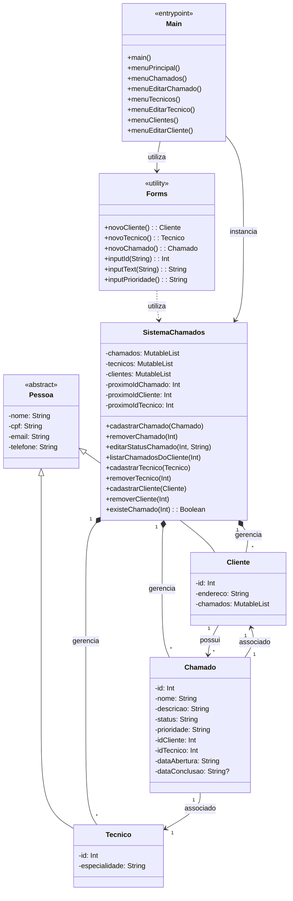

Claro! Aqui está um README mais estilizado, com uma apresentação mais visual e organizada:


# 📞 **Sistema de Gerenciamento de Chamados** 🎯

## 🚀 Descrição

Este projeto foi desenvolvido como parte do trabalho acadêmico do curso de **Análise e Desenvolvimento de Sistemas (ADS)**, no **terceiro período**. O sistema permite o gerenciamento de **chamados**, **clientes** e **técnicos** utilizando conceitos de **Programação Orientada a Objetos (POO)**.

Com ele, você pode cadastrar, editar, listar e remover técnicos, clientes e chamados, além de gerenciar as interações entre essas entidades.

---

## 🛠 Funcionalidades

### **Chamados**

- **Cadastrar Chamado**: Criação de um novo chamado associado a um cliente e a um técnico.
- **Editar Chamado**: Modificação de informações de um chamado, como nome, descrição, status e técnico.
- **Listar Chamados**: Exibição de todos os chamados cadastrados.
- **Remover Chamado**: Exclusão de um chamado existente.
- **Visualizar Chamados de um Cliente**: Listagem de todos os chamados associados a um cliente.

### **Técnicos**

- **Cadastrar Técnico**: Cadastro de técnicos, com nome, especialidade e contato.
- **Editar Técnico**: Edição de informações de técnicos, como nome, email, telefone e especialidade.
- **Listar Técnicos**: Exibição de todos os técnicos cadastrados.
- **Remover Técnico**: Exclusão de um técnico do sistema.

### **Clientes**

- **Cadastrar Cliente**: Cadastro de novos clientes com dados como nome, email, telefone e endereço.
- **Editar Cliente**: Modificação de dados de clientes, como nome, email, telefone e endereço.
- **Listar Clientes**: Exibição de todos os clientes cadastrados.
- **Remover Cliente**: Exclusão de um cliente do sistema.
- **Visualizar Chamados de um Cliente**: Exibição dos chamados vinculados a um cliente.

---

## 📊 Diagrama UML

### **Estrutura do Sistema**

Aqui está um diagrama UML representando as classes principais e suas relações no sistema:



---

## 📁 Estrutura do Projeto

### **Diretórios**

- `models/`: Contém as classes principais (`Pessoa`, `Tecnico`, `Cliente`, `Chamado`).
- `services/`: Contém a classe de lógica de negócios (`SistemaChamados`).
- `view/`: Contém o código de interação com o usuário (CLI), incluindo os formulários e menus.

---

## ⚙️ Como Executar

### Passo 1: Clonar o Repositório

Clone o repositório para sua máquina local:

```bash
git clone https://github.com/usuario/nome-do-repositorio.git
```

### Passo 2: Navegar até o Diretório

Entre no diretório do projeto:

```bash
cd nome-do-repositorio
```

### Passo 3: Executar o Projeto

Abra o projeto em uma IDE como o **IntelliJ IDEA** ou **Android Studio** e clique em **Run** no arquivo `Main.kt`. Caso prefira usar o terminal:

```bash
kotlinc src -include-runtime -d SistemaChamados.jar
java -jar SistemaChamados.jar
```

---

## 🧰 Tecnologias Utilizadas

- **Kotlin**: Linguagem de programação principal.
- **Programação Orientada a Objetos (POO)**: Princípios de POO como herança, encapsulamento e polimorfismo.
- **Interface de Linha de Comando (CLI)**: Interface simples para interação com o usuário.

---

## 📄 Licença

Este projeto está licenciado sob a **Licença MIT**. Consulte o arquivo [LICENSE](LICENSE) para mais detalhes.

---

## 🤝 Contribuição

Contribuições são bem-vindas! Para sugestões ou melhorias, abra uma **issue** ou envie um **pull request**.

---

## 📬 Contato

Caso tenha alguma dúvida ou sugestão, entre em contato comigo:

- **E-mail**: mariolsg.oficial@gmail.com
- **LinkedIn**: [https://www.linkedin.com/in/mariolz/](https://www.linkedin.com/in/mariolz/)
